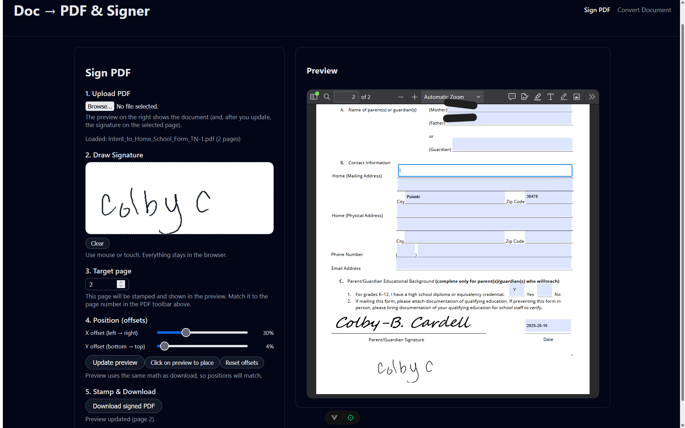
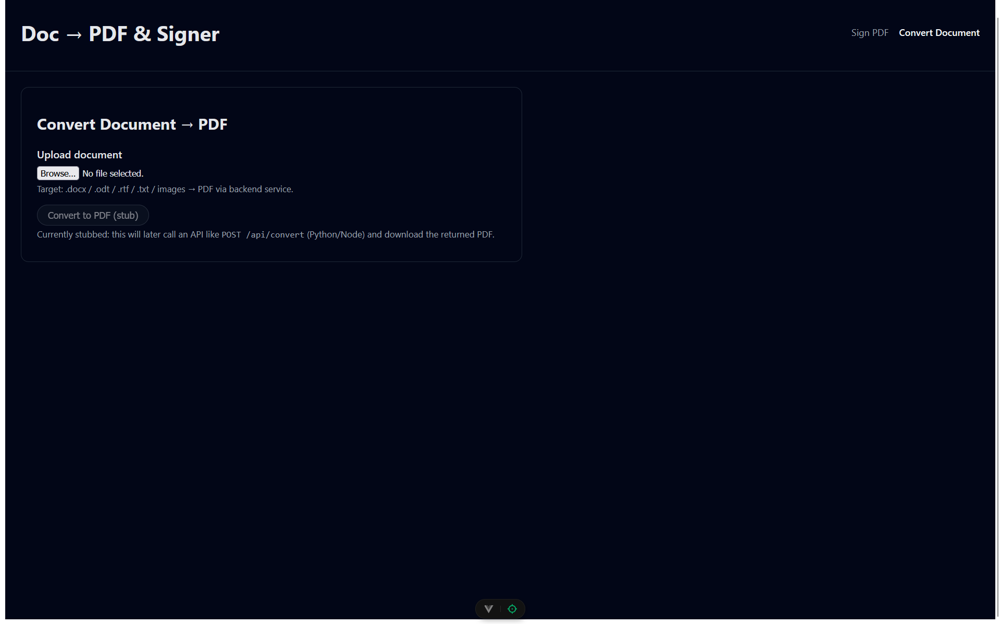

# Doc → PDF & Signer

Simple, local-only PDF signing and (future) document-to-PDF conversion.

All PDF processing and signatures happen in your browser – nothing is uploaded to a server.

---


---

### Sign PDF



### Convert Document (stub)



---

## Features

### Sign PDF (v1)

- Upload any existing PDF.
- Draw a signature with mouse or touch.
- Choose a target page to stamp.
- Position the signature using:
  - X/Y offset sliders, and/or
  - “Click on preview to place” (click roughly where you want the signature).
- Live preview of the stamped page in the built-in browser PDF viewer (scroll, zoom, etc. still work).
- Download a new, signed PDF.
- Signature pad is cached in `localStorage` so you don’t have to redraw every time.

### Convert Document → PDF (stub)

- UI stub for uploading non-PDF documents (`.docx`, `.odt`, `.rtf`, `.txt`, images, etc.).
- Currently shows a disabled “Convert to PDF (stub)” button.
- Intended future: call a backend (Python/Node) to convert docs to PDF and return the file.

---

## Tech stack

- **Frontend framework:** Vue 3
- **Dev/build:** Vite
- **PDF manipulation:** [`pdf-lib`](https://github.com/Hopding/pdf-lib)
- **Signature capture:** Custom `<SignaturePad>` component on `<canvas>`
- **Styling:** Vanilla CSS with a dark UI

Everything runs client-side. There is no backend yet.

---

## Getting started

### Prerequisites

- Node.js ≥ 18
- npm (or pnpm / yarn, adjust commands as needed)

### Install

```bash
# clone the repo
git clone https://github.com/<your-username>/pdf-signer-vue.git
cd pdf-signer-vue

# install dependencies
npm install
```

### Run dev server

```bash
npm run dev
```

> Open the URL Vite prints (usually http://localhost:5173).

### Build for production

```bash
npm run build
npm run preview   # optional: preview the built app locally
```

---

### How to use

- **Sign a PDF**
- Go to the “Sign PDF” route
- Top-right nav → `Sign PDF`.
- **Upload your PDF**

- Use the `Upload PDF` file input.
- The app loads the PDF in memory and shows it in the preview panel on the right using the browser’s PDF viewer.
- **Draw your signature**

- In `Draw Signature`, sign in the white canvas.
- Use mouse, trackpad, or touch.
- `Clear` will reset the pad.

- **Choose the target page**
- In `Target page`, enter the page number you want to stamp.
- The value is _clamped_ between 1 and the total page count.
- Match this to the page indicator in the PDF toolbar (`top of the preview iframe`)

- **Position the signature**
  > You have two options and can mix them:
- **Sliders**
- “**X** offset (`left → right`)” moves the signature horizontally.
- “**Y** offset (`bottom → top`)” moves the signature vertically.
- Offsets are percentages of the page; they are applied with the same math for _preview_ and _download_.

- **Click on preview**

- Click `Click on preview to place`.
- The preview becomes crosshair-enabled once.
- Click roughly where you want the signature on the page.
- The app converts that click into X/Y offsets and regenerates the preview.
- Scroll still works normally when placement mode is off.

- **Reset**
- `Reset offsets` returns to default offsets (80% X, 10% Y).

- **Update the preview**
- Click `Update preview`.
- The app:
- Embeds your signature into the chosen page using `pdf-lib`.
- Generates a temporary PDF.
- Shows it in the iframe preview on the right.

- **Download signed PDF**
- Click `Download signed PDF`.
- A new PDF named like `<original>_signed.pdf` is downloaded by the browser.

> Note: All operations use pdf-lib in the browser. The original and signed PDFs are not uploaded anywhere.

---

### Roadmap

- Implement backend API for document → PDF conversion.
- Allow multiple saved signatures and simple signature management.
- Per-document presets (remember offsets + page for each filename).
- Basic mobile layout improvements.
- Optional date / initial boxes.

---

### Development notes

- SignPdfView.vue:
- Handles PDF loading, offsets, preview generation, and stamping.
- Uses an `<iframe>` for viewing PDFs so browser zoom/search/scroll are preserved.
- `targetPage` is clamped to `[1, pageCount]`.
- Click-to-place uses a heuristic to account for toolbar + margins in the viewer.
- `SignaturePad.vue`
- Plain `<canvas>` drawing.
- Exposes `getPngDataUrl()`, `isEmpty()`,`clear()`, and a `loadFromDataUrl()` hook for restoring cached signatures.
